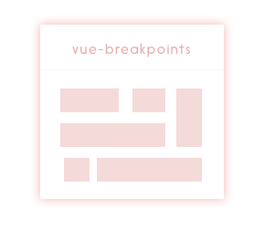

<p align="center">
  
</p>

# vue-breakpoints
[](https://travis-ci.org/apertureless/vue-breakpoints)
[](https://codecov.io/gh/apertureless/vue-breakpoints)
[](https://www.npmjs.com/package/vue-breakpoints)
[](https://vuejs.org/)
[](https://github.com/apertureless/vue-breakpoints/blob/master/LICENSE)

Vue.js utility component to show and hide components based on breakpoints

📺 [Demo](https://apertureless.github.io/vue-breakpoints/)

## 🔧  Install
`yarn add vue-breakpoints`

## 👈 Usage

```javascript

<template>
  <nav>
    <hide-at breakpoint="medium">
      <mobile-nav />
    </hide-at>
    <show-at breakpoint="mediumAndAbove">
      <desktop-nav>
    </show-at>
  </nav>
</template>

<script>
  import {showAt, hideAt} from 'vue-breakpoints'
  export default {
    components: { hideAt, showAt }
  }
</script>
```

## Breakpoints
You can pass following values as a breakpoint:

- small
- mediumAndBelow
- medium
- mediumAndAbove
- largeAndBelow
- large

### Default Breakpoints

Default breakpoints are

```js
small: 744,
medium: 1128,
large: Infinity
```

but they can be overwritten if you pass an object to the `breakpoints` prop.

```js
<show-at :breakpoints="{small: 620, medium: 1280, large: 1600}" breakpoint="medium">
```

## Props
| prop | default | type | description
|---|---|---|---|
| breakpoints | undefined | Object | Important that if you pass the object you only use `small`, `medium` and `large` as the childs.
| breakpoint | '' | String | Breakpoint where it should show or hide `small`, `mediumAndBelow`, `medium`, `mediumAndAbove`, `largeAndBelow`, `large`


## :scroll: Changelog
Details changes for each release are documented in the [CHANGELOG.md](https://github.com/apertureless/vue-breakpoints/blob/master/CHANGELOG.md).


## :exclamation: Issues
Please make sure to read the [Issue Reporting Checklist](https://github.com/apertureless/vue-breakpoints/blob/master/CONTRIBUTING.md#issue-reporting-guidelines) before opening an issue. Issues not conforming to the guidelines may be closed immediately.


## :muscle: Contribution
Please make sure to read the [Contributing Guide](https://github.com/apertureless/vue-breakpoints/blob/master/CONTRIBUTING.md) and [Code of Conduct](code-of-conduct.md) before making a pull request.

## :copyright: License

[MIT](http://opensource.org/licenses/MIT)
